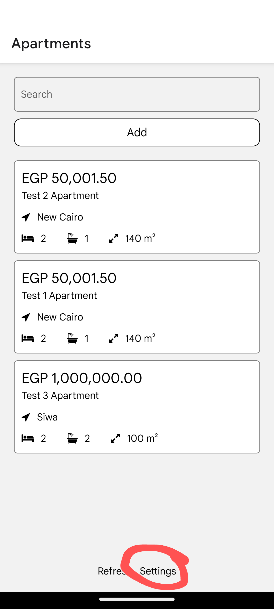
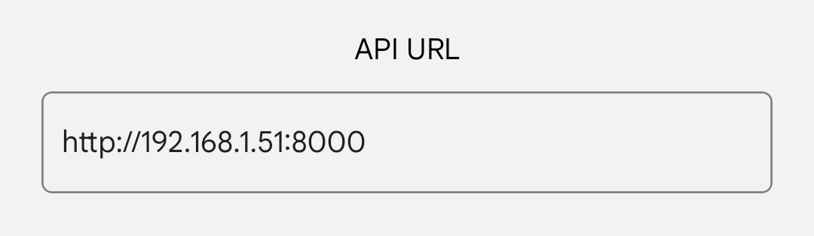

# Project Name

## Overview

This project consists of three main components:

1. **Backend**: An Express server running on port 8000.
2. **Frontend**: A Next.js application running on port 3000.
3. **Database**: A PostgreSQL database.

Additionally, there is a React Native mobile app built with Expo.

## Endpoints

### Backend

The backend provides the following endpoints:

- **`GET /apartments`**: Retrieves a list of all apartments.
- **`POST /apartments`**: Creates a new apartment.
- **`GET /apartment/:id`**: Retrieves details of a specific apartment by its ID.

## Docker Compose Setup

### Build and Run Instructions

#### Production

To build and run the frontend, backend, and database using Docker Compose, follow these steps:

1. **Clone the repository**:

2. **Build the Docker images**:

    ```sh
    docker-compose build
    ```

3. **Run the containers**:

    ```sh
    docker-compose up

    ```

#### Development

1. **Clone the repository**:

2. **Build the Docker images**:

    ```sh
    docker-compose -f docker-compose.dev.yml build
    ```

3. **Run the containers**:

    ```sh
    docker-compose -f docker-compose.dev.yml up
    ```


This will start the following services:

- **Backend**: Accessible at `http://localhost:8000`
- **Frontend**: Accessible at `http://localhost:3000`
- **Database**: Running PostgreSQL

## React Native Mobile App

The React Native mobile app uses Expo for development. Ensure you set the correct URL for the backend in the app settings. 

### Running the Mobile App through Expo Go

1. Install the Expo Go app on your mobile device.
2. Run the following command in the project directory:

    ```sh
    npx expo start
    ```
3. Scan the QR code using the Expo Go app.


### Instructions for Setting Backend URL

There are two ways to set the backend URL:
#### Method 1: Change the URL in the App Code
1. Open the React Native project.
2. Locate the settings file `.env` .
3. Set the backend URL to `http://<your-ip-address>:8000`.

**Example**:
```env
EXPO_PUBLIC_API_URL=http://192.168.1.51:8000
```

#### Method 2: Through the App Settings
1. Open the Expo app on your mobile device.
2. Go to the settings.

3. Set the backend URL to `http://<your-ip-address>:8000`.


